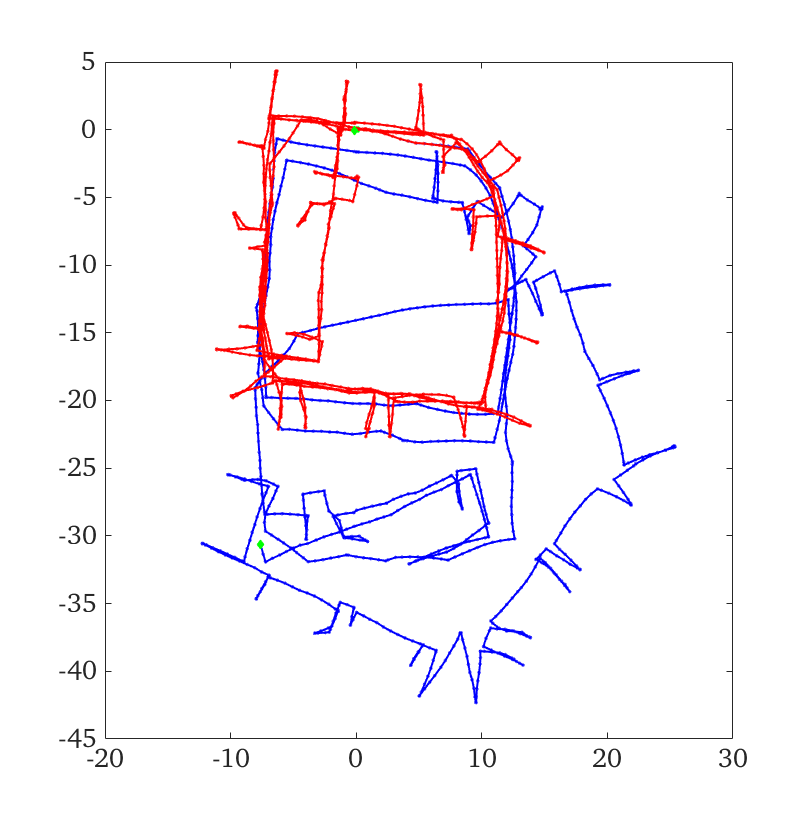
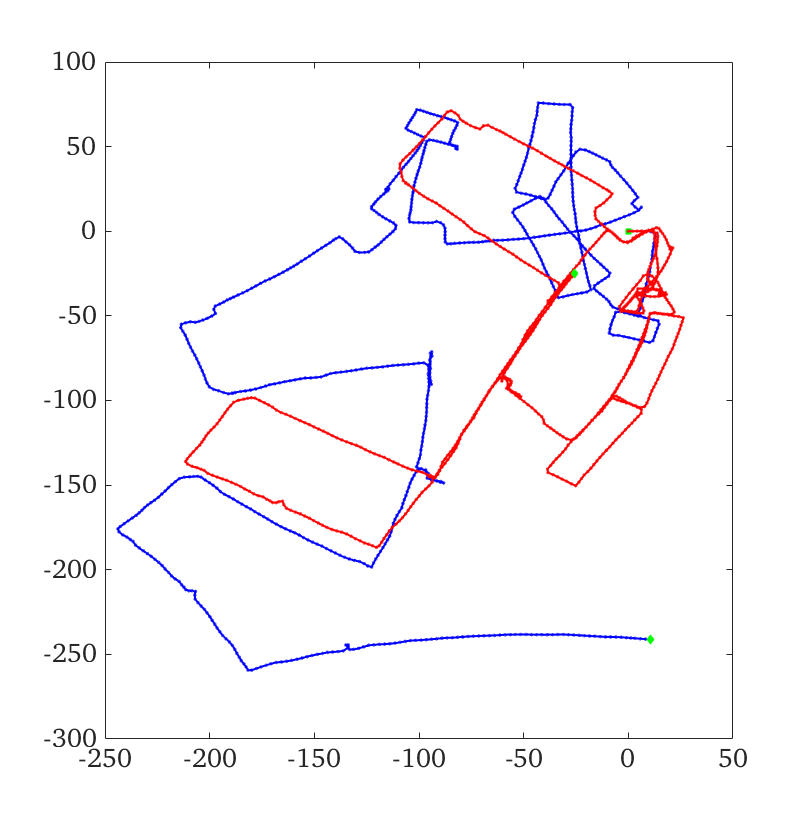
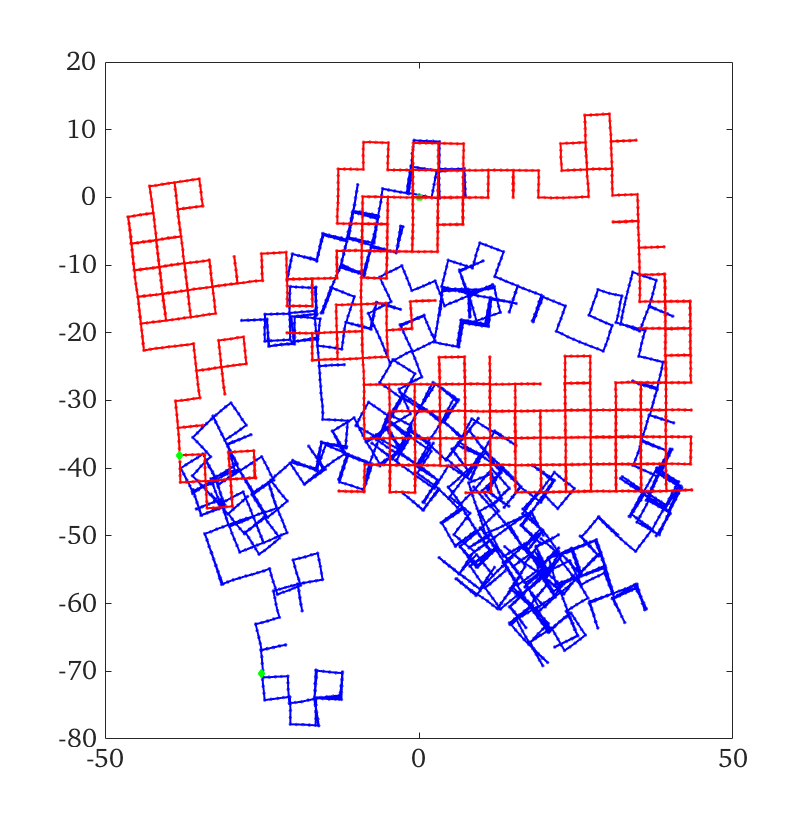

# Simple 2D Graph SLAM

This repository contains a simple graph solver/optimizer for the 2D graph SLAM problem.
This was done as part of MEEG 667-010 estimation class at the University of Delaware.
The data was originally taken from [Luca Carlone's](https://lucacarlone.mit.edu/datasets/) preprocessed data.
Originally the raw datasets where 2D LiDAR scans, but have been already converted into the [g2o format](data/g2oVStoro.pdf) for simplification.
The solver is based on the [A Tutorial on Graph-Based SLAM](data/grisetti10titsmag.pdf) by Grisetti et al.
Simply run the build_and_solve.m script to load the graph and optimize it.
Figures below have the initial guess in blue with the optimized value in red.

### Intel Dataset

### MIT Dataset

### M3500 Dataset

